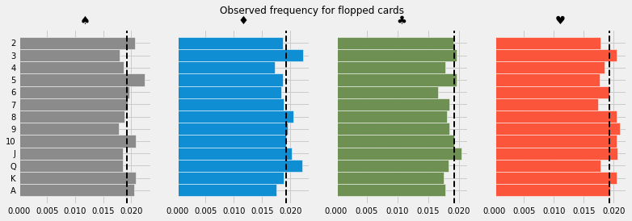
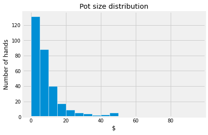
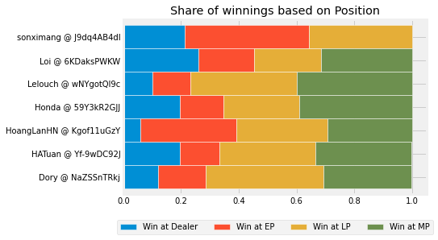
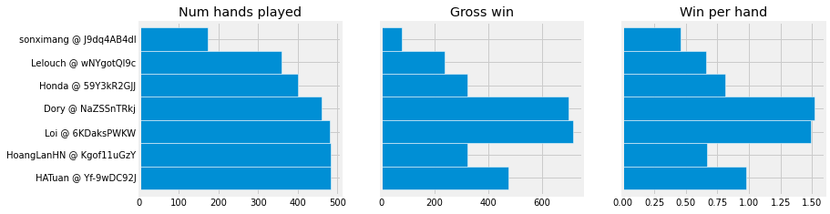

Analyzing poker game play from game log (WIP)
---
[See full notebook on nbviewer](https://nbviewer.org/github/dobeok/analyze-pokernow-games/blob/main/analyze.ipynb)

Intro/Motivation
---
During the lockdown, my friend group couldn't meet face to face and play board games together. We found some online alternatives for our casual games (thanks to [pokernow.club](https://www.pokernow.club/)). One unintended consequence is that after the game sessions, I can download the game logs and analyze it! I wanted to find out what the winning players are doing differently, and hopefully improve my game.

Since the raw log file is quite unstructured, I spent most of the time cleaning the data. I primarily used pandas together with SQL.

Preview
---
|Game setup analysis|
|-------------------------|
|

|

|Gameplay analysis|
|-------------------------|
|

|
|

|
|

|

**Observations**

- Common characteristics of a good players:
    - Aggressive (raise more than limp)
    - Play fewer hands (lower VPIP)
    - Utilize their positions (play & win more hands in position)

TODO
---
- [ ] Analyze if the cards show up at expected frequencies
- [ ] Analyze change in %VPIP and other metrics as the game progressed (reference: https://pokercopilot.com/poker-statistics/vpip-pfr)
- [ ] Create front-end for drag-and-drop UI for easy sharing