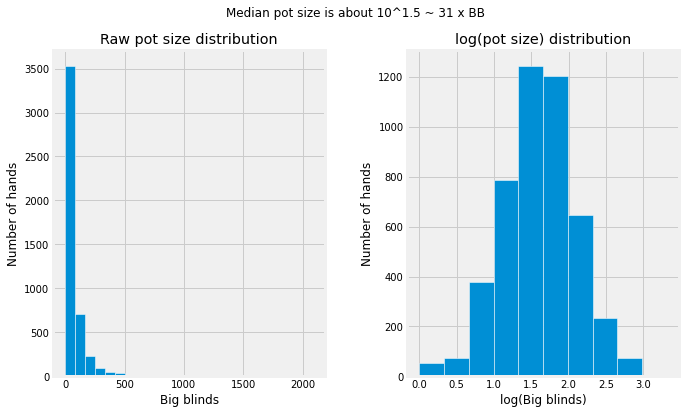

Analyzing poker game play from game log (WIP)
---
[VIEW NOTEBOOK]

Intro/Motivation
---
During the lockdown, my friend group couldn't meet face to face and play board games together. We found some online options for our casual games. One unintended consequence is that after the game sessions, I can get the game logs and analyze it! I wanted to find out what the winning players are doing differently, and hopefully improve my game.

Since the raw log file is quite unstructured, I spent most of the time cleaning the data. I primarily used pandas together with SQL.

Summary results (click to see full notebook)
---

Play style
Summarised stats and comments
- Common characteristics of a good players:
    - Aggressive
    - Play fewer hands
    - Utilize their positions (play & win more hands in position)

TODO
---
- [ ] Analyze if the cards show up at expected frequencies
- [ ] Analyze change in %VPIP and other metrics as the game progressed (reference: https://pokercopilot.com/poker-statistics/vpip-pfr)
- [ ] Create front-end for drag-and-drop UI for easy sharing