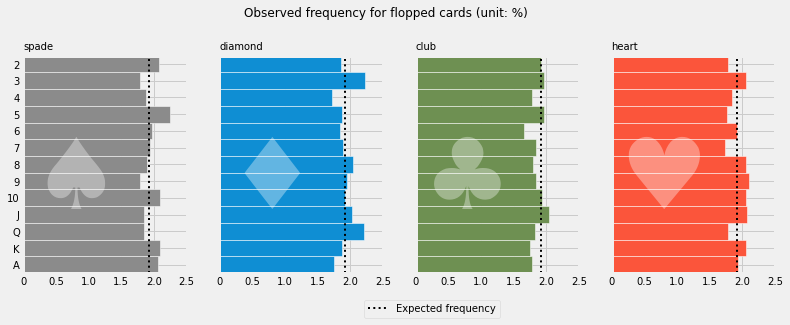
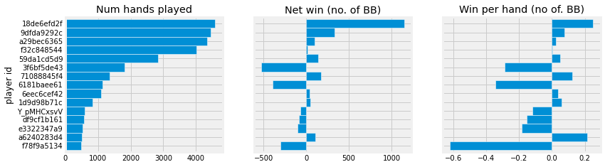
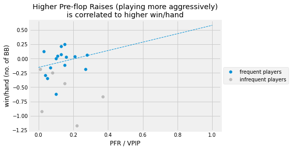

Analyzing poker game play
---
[See full notebook on nbviewer](https://nbviewer.org/github/dobeok/analyze-pokernow-games/blob/main/B-game-play/analyze.ipynb)

Repo structure
---
```
.
├── A-game-setup: analyze game set up (card frequency, hand distribution)
├── B-game-play: analyze players' patterns
├── README.md
├── data: raw log files and cleaned data
├── requirements.txt
└── resources
```
Intro/Motivation
---
During the lockdown, my friend group couldn't meet face to face and play board games together. We found some online alternatives for our casual games (thanks to [pokernow.club](https://www.pokernow.club/)). One unintended consequence is that after the game sessions, I can download the game logs and analyze it! I wanted to find out what the winning players are doing differently, and hopefully improve my game.


Since the raw log file is quite unstructured, I spent most of the time cleaning the data. I primarily used pandas together with SQL.


Preview
---
#### [A] Game setup

|Game setup analysis|
|-------------------------|
|<p align="center"></p>|

**Chi-squared goodness-of-fit test for randomess of cards**
|Test|chi2 statistics|p-value|Decision
|:-:|:-:|:-:|:-:|
|H0: cards are randomly dealt<br>H1: cards are not randomly dealt|64.21|0.10|Do not reject Null hypothesis.<br>Insufficient evident to conclude that cards dealt are not random|


#### [B] Game play

|Gameplay analysis|
|-------------------------|
|<p align="center"></p>|
|<p align="center"></p>|
|<p align="center"></p>|
|<p align="center"></p>|

**Observations**

- Common characteristics of a good players:
    - Aggressive (raise more than limp)
    - Play fewer hands (lower VPIP)
    - Utilize their positions (play & win more hands in position)


TODO
---
- [x] Analyze if the cards show up at expected frequencies
- [ ] Analyze change in %VPIP and other metrics as the game progressed (reference: https://pokercopilot.com/poker-statistics/vpip-pfr)
- [ ] Create front-end for drag-and-drop UI for easy sharing

