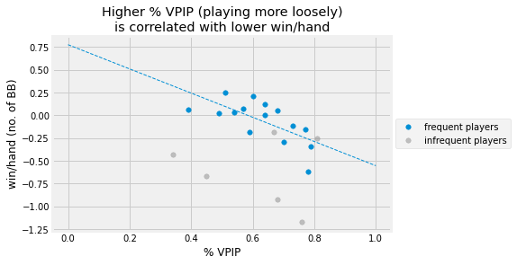

Analyzing poker game play from game log
---
[See full notebook on nbviewer](https://nbviewer.org/github/dobeok/analyze-pokernow-games/blob/main/analyze.ipynb)

Intro/Motivation
---
During the lockdown, my friend group couldn't meet face to face and play board games together. We found some online alternatives for our casual games (thanks to [pokernow.club](https://www.pokernow.club/)). One unintended consequence is that after the game sessions, I can download the game logs and analyze it! I wanted to find out what the winning players are doing differently, and hopefully improve my game.

Since the raw log file is quite unstructured, I spent most of the time cleaning the data. I primarily used pandas together with SQL.

Preview
---
|Game setup analysis|
|-------------------------|
|

|

**Chi-squared goodness-of-fit test for randomess of cards**
| card   | freq   | expected_freq   | O - E   | (O - E)^2   | (O - E)^2 / E   |
|:-------|:-------|:----------------|:--------|:------------|:----------------|
| A♥     | 253    | 250.788         | 2.212   | 4.891       | 0.020           |
| K♥     | 268    | 250.788         | 17.212  | 296.237     | 1.181           |
| Q♥     | 233    | 250.788         | -17.788 | 316.429     | 1.262           |
| ...    | ...    | ...             | ...     | ...         | ...             |
| 4♠     | 244    | 250.788         | -6.788  | 46.083      | 0.184           |
| 3♠     | 233    | 250.788         | -17.788 | 316.429     | 1.262           |
| 2♠     | 270    | 250.788         | 19.212  | 369.083     | 1.472           |
| Chi-squared statistics | | || |64.21|

    - H0: Null hypothesis: cards are dealt randomly
    - HA: Alternative hypothesis: cards are not dealt randomly

        alpha = 0.05
        degrees of freedom = 52 - 1 = 51

        calculated chi-squared statistics = 64.21
        critial chi-squared value at given alpha and dof= 68.67

    - Calculated chi-squared statistics < critical value
    - We do not reject our null hypothesis
    - The cards discrepancies are due to random chances

|Gameplay analysis|
|-------------------------|
|

|
|

|
|

|
|

|

**Observations**

- Common characteristics of a good players:
    - Aggressive (raise more than limp)
    - Play fewer hands (lower VPIP)
    - Utilize their positions (play & win more hands in position)

TODO
---
- [x] Analyze if the cards show up at expected frequencies
- [ ] Analyze change in %VPIP and other metrics as the game progressed (reference: https://pokercopilot.com/poker-statistics/vpip-pfr)
- [ ] Create front-end for drag-and-drop UI for easy sharing

